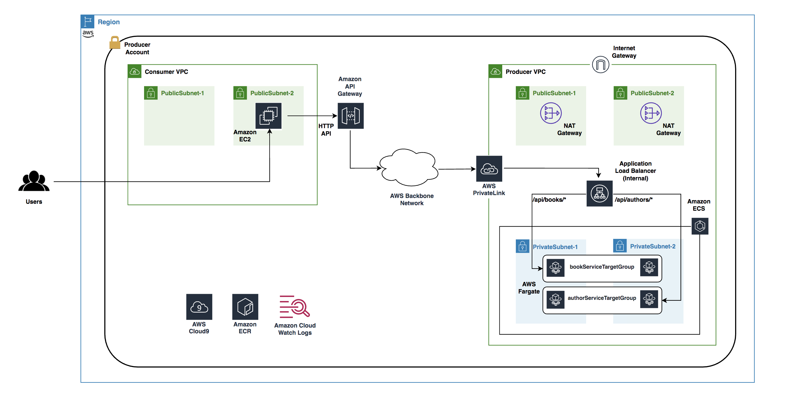
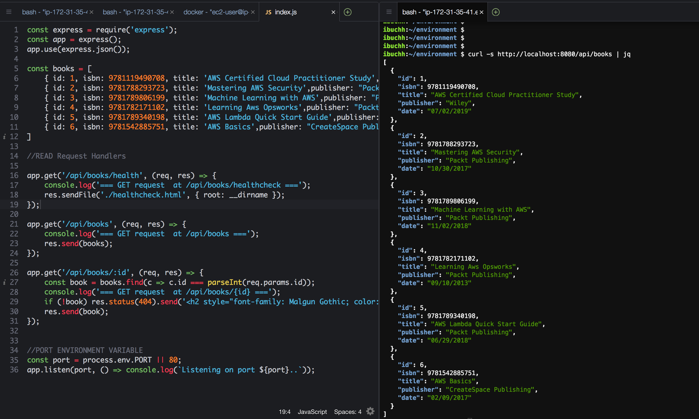
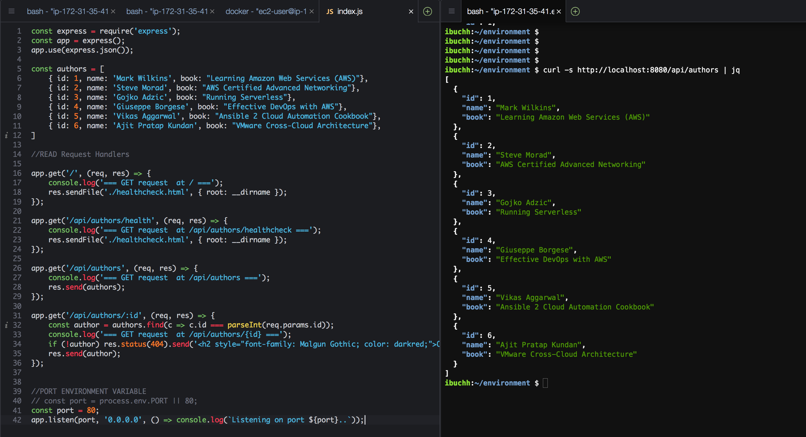

# Build HTTP API Based Services using Amazon API Gateway, AWS PrivateLink, AWS Fargate and AWS CDK
[](https://travis-ci.org/joemccann/dillinger)
## Introduction
Prior to the availability of AWS PrivateLink, services residing in a single Amazon VPC were connected to multiple Amazon VPCs either (1) through public IP addresses using each VPC’s internet gateway or (2) by private IP addresses using VPC peering.

Solution: With AWS PrivateLink, service connectivity over Transmission Control Protocol (TCP) can be established from the service provider’s VPC (Producer) to the service consumer’s VPC (Consumer) in a secure and scalable manner. Tom Adamski has provided an architecture where he shows one way of using AWS PrivateLink along with ALB and NLBs to publish Internet applications at scale. Mani Chandrasekaran provided a solution where he uses API Gateway to expose applications running on AWS Fargate using REST APIs, but it uses NLB since ALB is not yet supported by this architecture.

Our solution leverages the existing applications/ APIs running in AWS Fargate behind a Private ALB inside a VPC and proposes an architecture to expose these APIs securely through HTTP APIs using Amazon API Gateway and AWS PrivateLink.

The target audience for this blog post are developers and architects who want to architect API based services using the existing applications running inside Amazon VPCs.

## Prerequisites
In order to implement the instructions laid out in this post, you will need the following:
- An AWS account (Producer Account)
- A GitHub account

## Architecture
As shown in Fig 1, we create one AWS CDK application consisting of two AWS CDK stacks FargateVpclinkStack and HttpApiStack. Inside the FargateVpclinkStack, we deploy two NodeJS microservices (book-service and author-service) using Amazon Fargate within the Producer VPC. An internal load balancer distributes external incoming application traffic across these two microservices. In order to implement the private integration we create a VpcLink to encapsulate connections between API Gateway and these microservices. Inside the HttpApiStack, we create an Http Api that integrates with the Amazon Fargate microservices running inside the FargateVpclinkStack using the Vpclink and internal load balancer listener.


*Fig 1 - Architecture*

Here are the steps we’ll be following to implement the above architecture:

- Create and configure AWS Cloud9 environment
- Develop two sample microservices
- Deploy the sample services on Amazon ECS using Fargate
- Create an HTTP API based on the Fargate Services
- Provisioning AWS resources using the CDK
- Testing the Http Api
- Cleanup


## Create and configure AWS Cloud9 environment
Log into the AWS Management Console and search for Cloud9 service in the search bar.

Click Cloud9 and create an AWS Cloud9 environment in the us-west-2 region based on Amazon Linux 2. Create an IAM role for Cloud9 workspace as explained [here](https://www.eksworkshop.com/020_prerequisites/iamrole/). Attache the IAM role to your workspace as explained [here](https://www.eksworkshop.com/020_prerequisites/ec2instance/). Turn off the AWS managed temporary credentials of the Cloud9 environment as explained [here](https://www.eksworkshop.com/020_prerequisites/workspaceiam/). Open a new terminal in Cloud9 and install jq using the command:

```bash
sudo yum install jq -y
```

## Develop two sample microservices

### Clone the GitHub repository

Open a new terminal inside AWS Cloud9 IDE and run:

git clone https://github.com/aws-samples/http-api-aws-fargate-cdk.git

- Containerize and test book-service locally

```bash
cd ~/environment/http-api-aws-fargate-cdk/src/book-service
npm install --save 
docker build -t book-service  .
docker tag book-service:latest \ 
XXXXXXXXXXX.dkr.ecr.us-west-2.amazonaws.com/book-service:latest

docker run -p8080:80 book-service
```
Click the `Preview/Preview Running Application` and append api/books/health to the end of the url so that url looks like `https://XXXXXXXXXXXXXXXXXXX.vfs.cloud9.us-west-2.amazonaws.com/api/books/health` . Observe the response from the running book-service service as shown in Fig 2.


*Fig 2 - Books Service*

Open a new terminal inside AWS Cloud9 IDE and run the following curl command:

```bash
curl -s http://localhost:8080/api/books | jq
```
Observe the response as shown in Fig 3.


*Fig 3 - Books Service*

- Containerize and test author-service locally
```bash
cd ~/environment/http-api-aws-fargate-cdk/src/author-service
npm install --save 
docker build -t author-service  .
docker tag author-service:latest \ 
XXXXXXXXXXX.dkr.ecr.us-west-2.amazonaws.com/author-service:latest

docker run -p8080:80 author-service
```
Click the `Preview/Preview Running Application` and append api/authors/health to the end of the url so that url looks like `https://XXXXXXXXXXXXXXXXXXX.vfs.cloud9.us-west-2.amazonaws.com/api/authors/health` . Observe the response from the running book-service service as shown in Fig 4.


*Fig 4 - Authors Service*

### Create Amazon ECR repositories

Amazon ECR registries host your container images in a highly available and scalable architecture, allowing you to deploy containers reliably for your applications. Each AWS account is provided with a single (default) Amazon ECR registry. 

```bash
aws ecr get-login-password --region us-west-2 | docker login  --username AWS   --password-stdin XXXXXXXXXXX.dkr.ecr.us-west-2.amazonaws.com

aws ecr get-login-password --region us-west-2 | docker login --username AWS --password-stdin 082037726969.dkr.ecr.us-west-2.amazonaws.com

aws ecr create-repository \
    --repository-name book-service \
    --image-scanning-configuration scanOnPush=false \
    --region us-west-2

aws ecr create-repository \
    --repository-name author-service \
    --image-scanning-configuration scanOnPush=false \
    --region us-west-2
```

### Push images to Amazon ECR

```bash
docker push XXXXXXXXXXX.dkr.ecr.us-west-2.amazonaws.com/book-service:latest

docker push XXXXXXXXXXX.dkr.ecr.us-west-2.amazonaws.com/author-service:latest
```
## Deploy the sample microservices on Amazon ECS using Fargate

### Install AWS CDK

The AWS Cloud Development Kit (AWS CDK) is an open-source software development framework to model and provision your cloud application resources using familiar programming languages. If you would like to familiarize yourself the CDKWorkshop is a great place to start.

Using Cloud9 environment, open a new Terminal and use the following commands:
```bash
cd http-api-aws-fargate-cdk/cdk
npm install -g aws-cdk@latest
cdk --version
```

Take a note of the latest version that you install, at the time of writing this post it is 1.79.0. Open the package.json file and replace the version “1.79.0” of the following modules with the latest version that you have installed above.

```typescript
    "@aws-cdk/assert": "1.79.0",
    "@aws-cdk/aws-apigatewayv2": "1.79.0",
    "@aws-cdk/core": "1.79.0",
    "@aws-cdk/aws-ec2": "1.79.0",
    "@aws-cdk/aws-ecr": "1.79.0",
    "@aws-cdk/aws-ecs": "1.79.0",
    "@aws-cdk/aws-elasticloadbalancingv2": "1.79.0",
    "@aws-cdk/aws-iam": "1.79.0",
    "@aws-cdk/aws-logs": "1.79.0",
```
```bash
npm install
```
This will install all the latest CDK modules under the node_modules directory.

### Creating AWS resources using the CDK

We shall implement this architecture using two individual CDK stacks:

- FargateVpclinkStack -- contains the Fargate and Vpclink resources.
- HttpApiStack -- contains the Http Api integrated with Fargate services using Vpclink.

Let us discuss these stacks one by one.

### **FargateVpclinkStack**

Under the cdk/singleAccount/lib folder, open the fargate-vpclink-stack.ts file and let us explore the following different CDK constructs.

Export Vpclink and ALB Listener:
```typescript
 public readonly httpVpcLink: cdk.CfnResource;
 public readonly httpApiListener: elbv2.ApplicationListener;
 ```

These two variables enable us to export the provisioned Vpclink along with the ALB Listener from **FargateVpclinkStack** stack so as to use these to create the Http Api in the **HttpApiStack** stack.

**VPC:**

This single line of code creates a ProducerVPC with two Public and two Private Subnets.
```typescript
    const vpc = new ec2.Vpc(this, "ProducerVPC");
```

**ECS Cluster:**

This creates an Amazon ECS cluster inside the ProducerVPC, we shall be running the two microservices inside this ECS cluster using AWS Fargate.

```typescript
    const cluster = new ecs.Cluster(this, "Fargate Cluster" , {
      vpc : vpc,
});
```

**Cloud Map Namespace:**

AWS Cloud Map allows us to register any application resources, such as microservices, and other cloud resources, with custom names.Using AWS Cloud Map, we can define custom names for our application microservices, and it maintains the updated location of these dynamically changing microservices.

```typescript
    const dnsNamespace = new servicediscovery.PrivateDnsNamespace(this,"DnsNamespace",{
        name: "http-api.local",
        vpc: vpc,
        description: "Private DnsNamespace for Microservices",
      }
    );
```
**ECS Task Role:**
```typescript
    const taskrole = new iam.Role(this, 'ecsTaskExecutionRole', {
      assumedBy: new iam.ServicePrincipal('ecs-tasks.amazonaws.com')
    });

    taskrole.addManagedPolicy(iam.ManagedPolicy.fromAwsManagedPolicyName('service-role/AmazonECSTaskExecutionRolePolicy'))
```
    
**Task Definitions:**

A task definition is required to run Docker containers in Amazon ECS, we shall create the task definitions (bookServiceTaskDefinition and authorServiceTaskDefinition) for the two microservices.
```typescript
    const bookServiceTaskDefinition = new ecs.FargateTaskDefinition(this,
'bookServiceTaskDef', {
      memoryLimitMiB: 512,
      cpu: 256,
      taskRole: taskrole
    });

      const authorServiceTaskDefinition = new ecs.FargateTaskDefinition(this, 
'authorServiceTaskDef', {
      memoryLimitMiB: 512,
      cpu: 256,
      taskRole: taskrole
    });
```
**Log Groups:**

Let us create two log groups bookServiceLogGroup and authorServiceLogGroup and the two associated log drivers.

```typescript
    const bookServiceLogGroup = new logs.LogGroup(this, "bookServiceLogGroup", {
      logGroupName: "/ecs/BookService",
      removalPolicy: cdk.RemovalPolicy.DESTROY
    });
    
    const authorServiceLogGroup = new logs.LogGroup(this, "authorServiceLogGroup", {
      logGroupName: "/ecs/AuthorService",
      removalPolicy: cdk.RemovalPolicy.DESTROY
    });
    
    const bookServiceLogDriver = new ecs.AwsLogDriver({
        logGroup: bookServiceLogGroup,
        streamPrefix: "BookService"
      });
      
    const authorServiceLogDriver = new ecs.AwsLogDriver({
        logGroup: authorServiceLogGroup,
        streamPrefix: "AuthorService"
      });
```